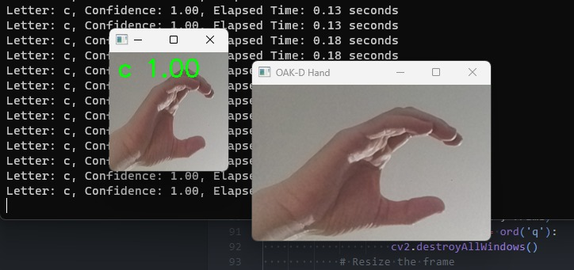
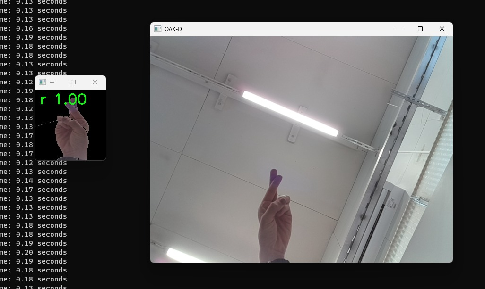
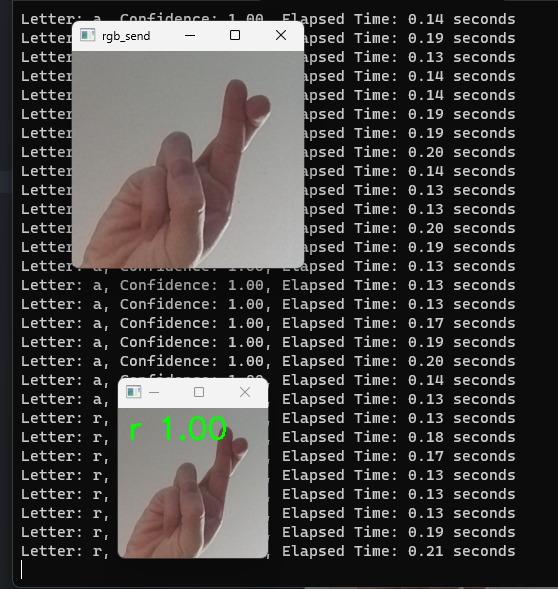

# American Sign Language Recognition using ConvNeXtBase and OAK-D Camera
Hardware Acceleration for AI - Final Project

## Group Members
- Carlos Cueto
- Henry Ascencio
- Vasista Kodumagulla
- Aman Vyas

## Project Description
Develop a CNN to classify hand gestures into the 26 letters of the American Sign Language Alphabet, and measure the performance of the CNN locally and on an API server.

## Requirements
- OAK-D Camera
- Python 3.9 or higher
- Tensorflow 2.10.0 or higher
- Django 4.1.7 or higher
- Django Rest Framework 3.14.0 or higher
- Django Rest Framework jsonapi 6.0.0 or higher
- NVIDIA GPU (Optional)

## Project Structure
- `backend` - Contains the code for the API server. The API server is written in Python using Django and Django Rest Framework.
    - `models` - Contains the code for the models used in the API server.
    - `image_processing` - Contains the code for the image processing functions used in the API server.
- `client` - Contains the code for the client application. It contains two parts:
    - `local_prediction` - Contains the code for the local prediction application. It is written in Python using Keras and Tensorflow.
    - `server_prediction` - Contains the code for the server prediction application. It is written in Python using Keras and Tensorflow.
- `model` - Contains the Jupiter Notebook used to train the model. It will generate the directory `asl_model` which contains the model and the weights. You can find the model and the weights in the directory `backend/models/asl_model`.
    - `american_sign_language` - Contains the dataset used to train the model. It was obtained from [here](https://www.kaggle.com/datasets/ayuraj/american-sign-language-dataset).

## Installation
- To install the API server, navigate to the `backend` directory and run the following command:
    - `pip install -r requirements.txt`
    - **Notes:**
        - You may need to update the version of `tensorflow` to train the model to >= 2.11.0.
        - It is recommended to use a virtual environment to install the dependencies.

## Running the Project
- To run the API server, navigate to the `backend` directory and run the following commands:
    - *`python manage.py runserver`*

    The API server will be running on `http://localhost:8000/`.
- To run the local prediction application, navigate to the `client` directory and run the following commands:
    - *`python local_prediction.py`*

    The script is split into two functions, `process_frames` and `send_frames`, which are run in separate processes using the multiprocessing library.
    The `process_frames` function is responsible for capturing frames from the OAK-D camera and processing them to extract the hand region using MediaPipe's hand tracking API. Once the hand region is obtained, a mask is generated using Otsu thresholding and applied to the original frame to obtain only the hand. The resulting hand image is then added to a queue to be sent to the `send_frames` process.
    The `send_frames` function is responsible for receiving the hand images from the process_frames process and sending them to a server for further processing. The hand image is resized to 150x150 and fed into a pre-trained convolutional neural network (CNN) to predict the corresponding letter of the American Sign Language (ASL) alphabet. The predicted letter and confidence score are then printed to the console.
- To run the server prediction application, navigate to the `client` directory and run the following commands:
    - *`python server_prediction.py`*

    The script is split into two functions, `process_frames` and `send_frames`, which are run in separate processes using the multiprocessing library.
    The `process_frames` function is responsible for capturing frames from the OAK-D camera and processing them to extract the hand region using MediaPipe's hand tracking API. Once the hand region is obtained, a mask is generated using Otsu thresholding and applied to the original frame to obtain only the hand. The resulting hand image is then added to a queue to be sent to the `send_frames` process.
    The `send_frames` function is responsible for receiving the hand images from the `process_frames` process and sending them to a server for further processing. It does this by sending a POST request to the API server. The hand image is resized to 150x150 and fed into the pre-trained model located in the `backend/models/asl_model` directory on the server side. The predicted letter and confidence score are returned to the client and printed to the console.

## Results
- Sreenshots of the local prediction application:
    - 
    - 
- Sreenshots of the server prediction application:
    - 

## References
- [Dataset](https://www.kaggle.com/datasets/ayuraj/american-sign-language-dataset)
- [ConvNeXtBase](https://www.tensorflow.org/api_docs/python/tf/keras/applications/convnext/ConvNeXtBase)
- [OAK-D Camera](https://docs.luxonis.com/en/latest/pages/tutorials/first_steps/)
